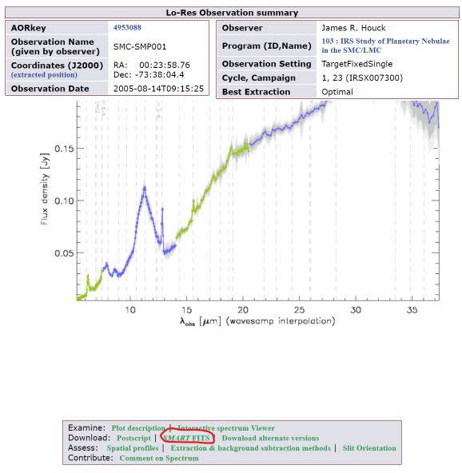

# A Machine Learning Approach To Stellar Spectra Classification

The aim of this project is to create a machine learning system that is capable of classifying spectra of stars, nebulae
and other stellar sources. It was made as a proof of concept to see if machine learning can perform as well as a team
of humans at classifying stellar sources based on their spectra.

This work was performed by Year 10 students as a Challenge Project at the Cambridge Academy for Science and Technology
in cooperation with The Institute for Research in Schools (IRIS) as part of the Cosmic Mining
initiative. 


## Requirements: 
A GPU is not required. The network we use is small enough to run well on a laptop CPU.

- Python 3.11
- PyTorch CPU 2.2 or greater
- matplotlib
- scikit-learn
- astropy

## Datasets
We use four different datasets. Additional training or test datasets can be added by modifying ```create_dataset.py```.
We obtain AOR keys and class labels from:
- Small Magellanic Cloud: ```Ruffle, Paul ME, et al. "Spitzer infrared spectrograph point source classification in the
Small Magellanic Cloud." Monthly Notices of the Royal Astronomical Society 451.4 (2015): 3504-3536.```
- Large Magellanic Cloud: ```Jones, Olivia C., et al. "The SAGE-Spec Spitzer Legacy program: the life-cycle of dust and
gas in the Large Magellanic Cloud. Point source classification–III." Monthly Notices of the Royal Astronomical Society
470.3 (2017): 3250-3282.```
- Galactic Plane: Supplied by IRIS.
- Bulge: Unlabelled test set supplied by IRIS.

## Download Fits Files
The ```aor_files``` directory in this repository contains .csv files that in turn contain the AOR keys and pointing numbers
for all the examples in the four datasets. Using the AOR keys and pointing numbers, low-resoltion spectra SmartFits
files must be downloaded from [CASSIS](https://cassis.sirtf.com/atlas/query.shtml) and placed in the corresponding
directory within the ```fits_files``` directory in this repository.

The image below depicts a sample Lo-Res spectrum for AOR Key 4953088. To download the Smart Fits file click on the
link circled in red.



## Usage
Once all the spectra files have been downloaded. You can run the code.  Switch to the top-level directory in this
repository and execute any of the commands below.

To run the code using the Small Magellanic Cloud, Large Magellanic Cloud, and Galactic Plane data using 80% for
training and 20% for testing run:

```python run.py --test_set split_train```

To run the code using the Small Magellanic Cloud and Large Magellanic Cloud data for training and Galactic Plane
data for testing run:

```python run.py --test_set galactic_plane```

To run the code using the Small Magellanic Cloud, Large Magellanic Cloud data, and Galactic Plane for training and
Bulge data for testing run:

```python run.py --test_set bulge```

When using the Bulge data, there are no labels, so only predictions can be made and no classification accuracy can be
computed. However, the predictions are saved in the ```predictions.csv``` file.

## Contact
To ask questions or report issues, please open an issue on the issues tracker.